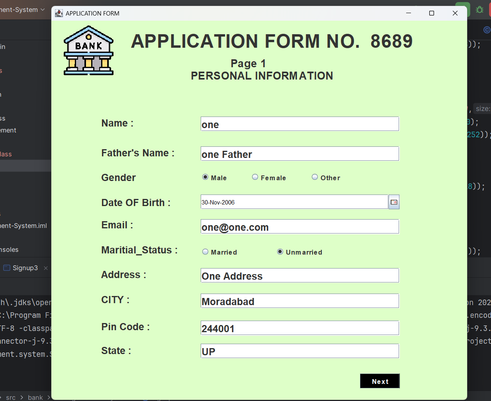
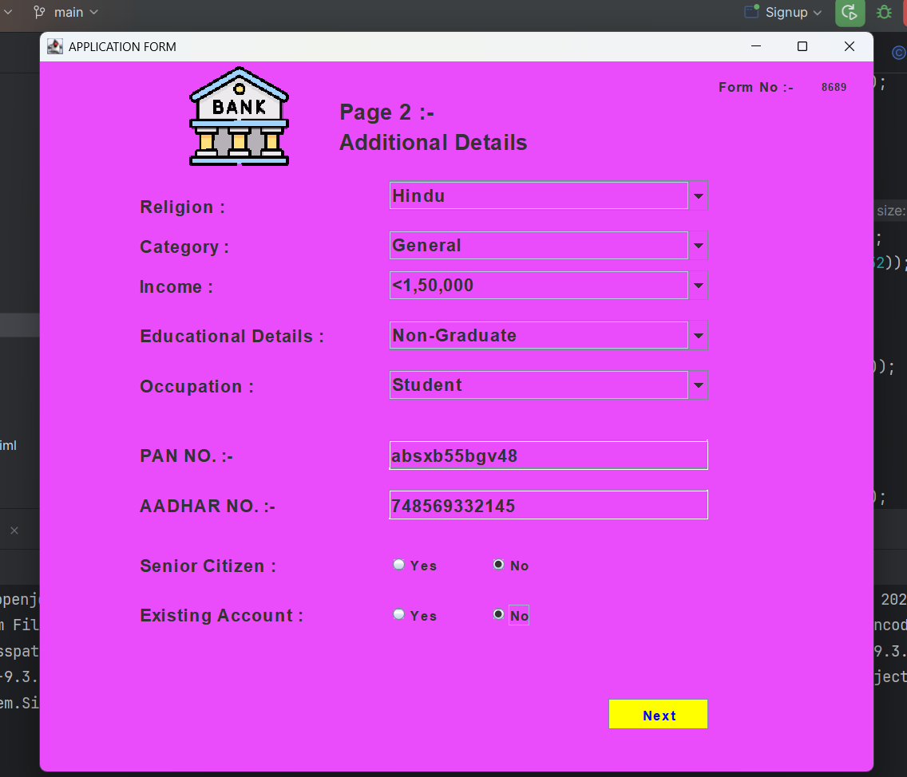
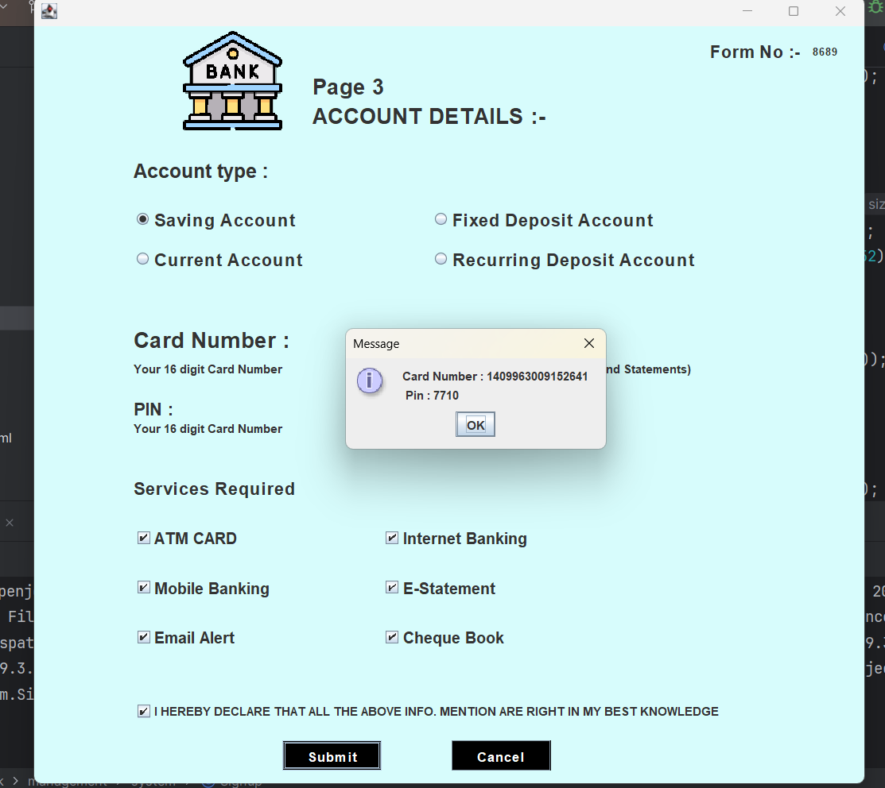
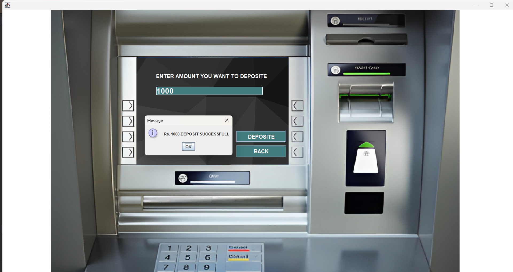
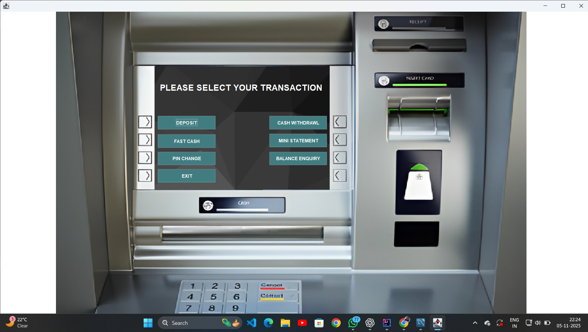
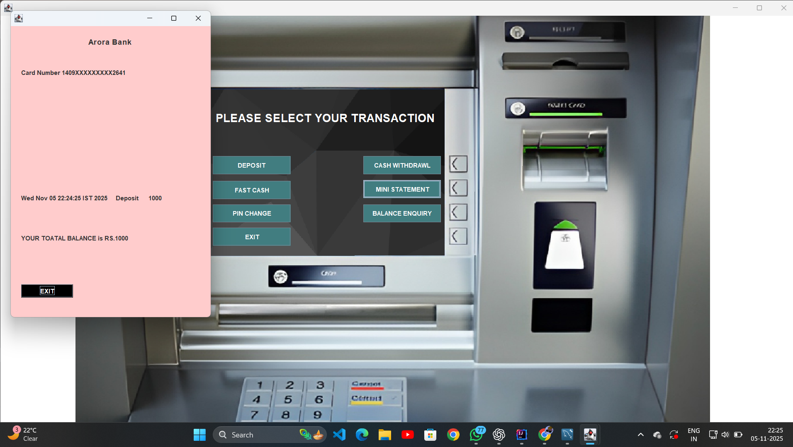

# 🏦 Bank Management System (Java Swing + MySQL)

A **fully functional desktop banking application** built using **Java Swing** and **MySQL**, providing all major banking operations — from account creation to secure fund transfers — through an easy-to-use graphical interface.

---

## 🚀 Features

- 🔐 **Secure Login System**  
  Authenticate users with credentials stored in the MySQL database.

- 🆕 **Multi-Step Account Registration**  
  Three-step signup (`Signup`, `Signup2`, `Signup3`) to collect personal and account details.

- 💰 **Deposit Module**  
  Deposit money directly into your account with instant balance update.

- 💸 **Cash Withdrawal**  
  Withdraw specific amounts safely, with automatic validation and transaction logging.

- ⚡ **Fast Cash**  
  Instantly withdraw preset amounts (₹1000, ₹2000, ₹5000, etc.) for convenience.

- 📋 **Mini Statement**  
  View and print recent transactions quickly using the `MiniStatement` module.

- 🔑 **Change PIN**  
  Securely update your ATM/Account PIN to enhance account safety.

- 🏠 **Interactive Dashboard (Main Class)**  
  Central hub that connects all modules with smooth navigation and a Swing-based GUI.

---
## **🖼️ Screenshots**

| SignIN1 | SignIN2 | SignIN3 | Deposite | Dashboard | MiniStatement |
|---|---|---|---|---|---|
|  |  |  |  |  |  |

---

## 🧩 Tech Stack

| Layer | Technology |
|-------|-------------|
| Frontend (UI) | Java Swing |
| Backend | Core Java |
| Database | MySQL |
| IDE | NetBeans / IntelliJ IDEA / Eclipse |
| Connector | MySQL JDBC Driver |

---

## ⚙️ Setup Instructions

### **1.Clone the Repository and Navigate to It**

```bash
git clone [https://github.com/your-username/Bank-Management-System.git](https://github.com/your-username/Bank-Management-System.git)
cd Bank-Management-System
```
### ** 2.Import the Project into Your IDE**
- Open the project folder in NetBeans, IntelliJ IDEA, or Eclipse.
### **3.Set Up the Database**
  Open MySQL and create a new database:
  ```bash
   CREATE DATABASE bankmanagementsystem;
 ```
- (Optional) Import the SQL file if available under /sql/bankmanagementsystem.sql.
- Update your database credentials in your Java connection file:
```bash
Connection con = DriverManager.getConnection(
    "jdbc:mysql://localhost:3306/bankmanagementsystem", "root", "yourpassword");
```
### **4.Add MySQL Connector/J**
- Download the MySQL Connector/J (e.g., mysql-connector-j-8.4.xx.jar).
- Add it to your project’s classpath or library folder so Java can connect to MySQL.
### **5.Run the Application**
- Execute Main_class.java in your IDE.
## Login with existing credentials or create a new account to explore all features 🎉

---

## **💡 Future Enhancements**

- 🌐 Online Banking Integration using REST APIs.
- 🔒 Data Encryption for enhanced security.
- 📧 Email / SMS Notifications for transactions.
- 🧑‍💼 Separate Admin and Customer Panels.
- 📱 Responsive Swing UI for modern look and feel.

---

## **👨‍💻 Author**

- **VANSH ARORA**
- 🎓 B.Tech CSE | Aspiring Software Engineer
- 🔗 [LinkedIn](https://www.linkedin.com/in/vansh-arora01)
 
